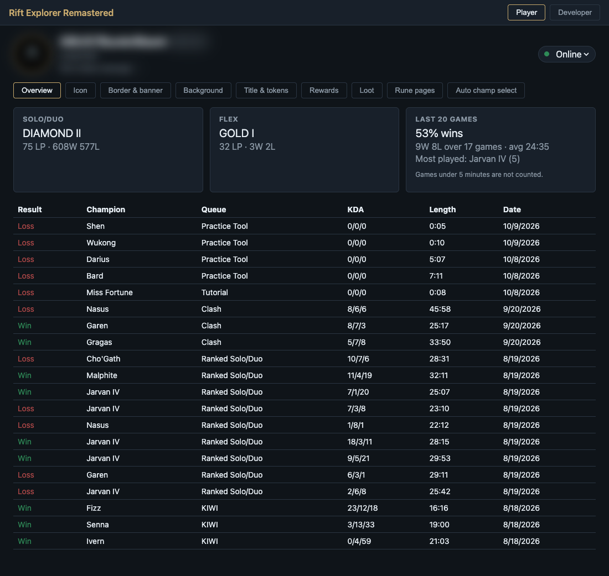
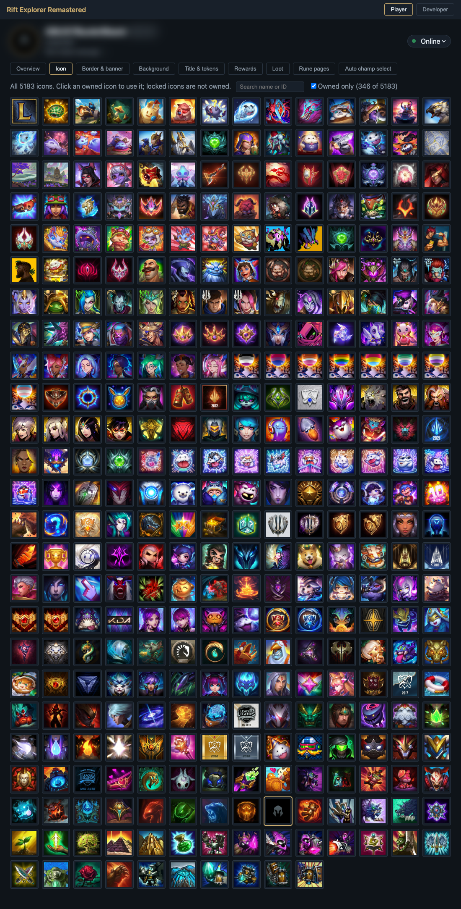
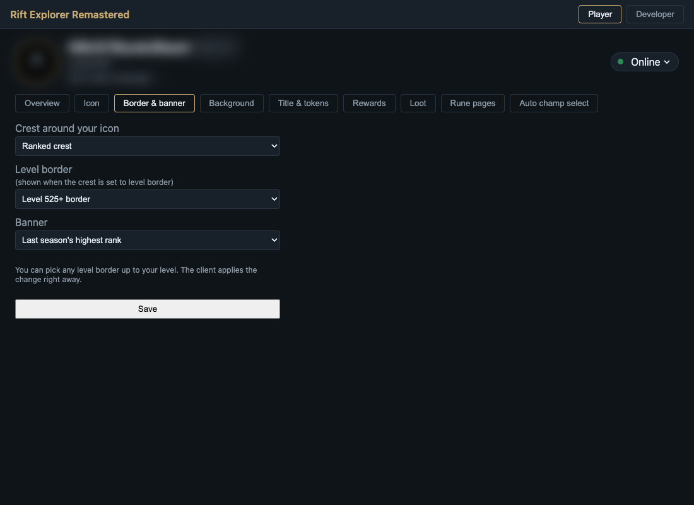
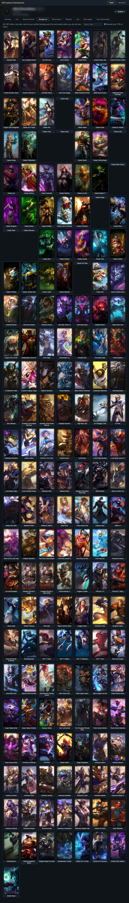
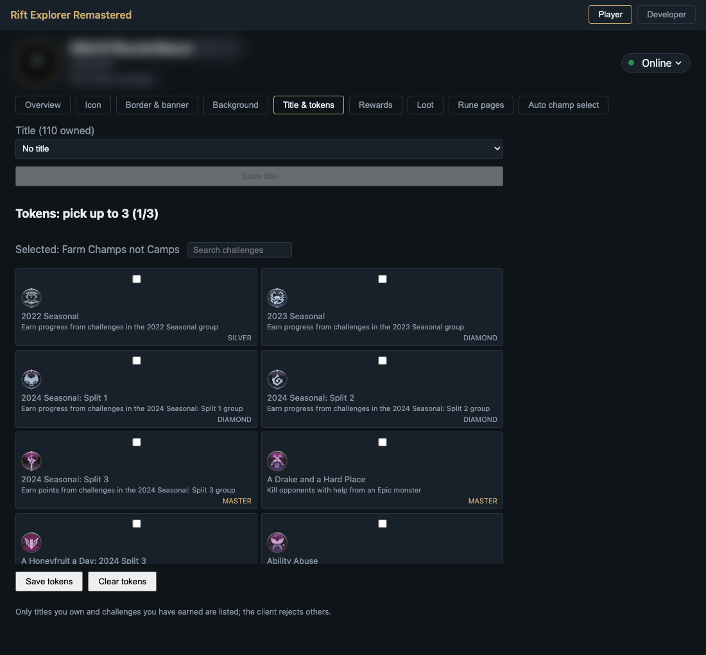
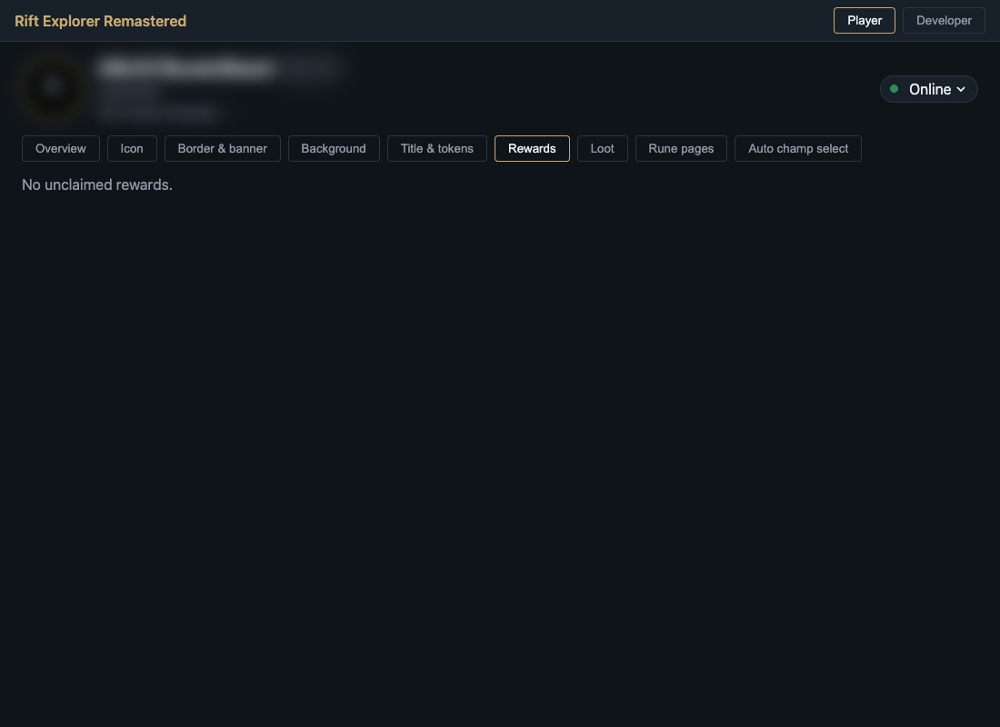
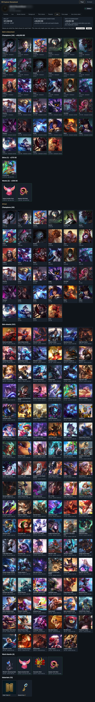
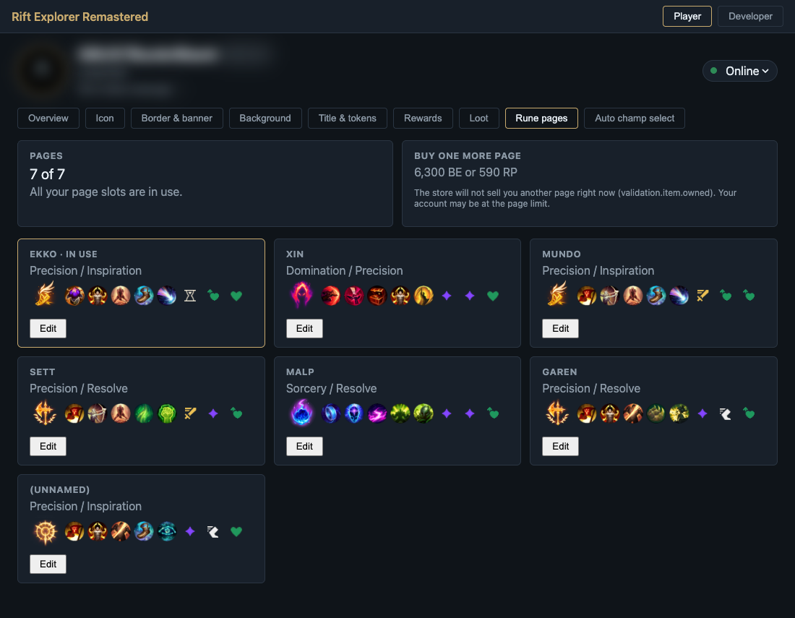
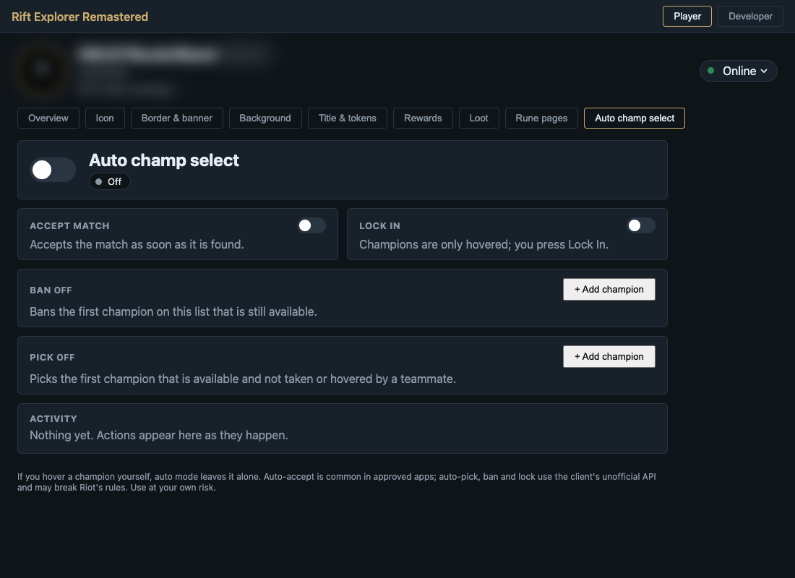
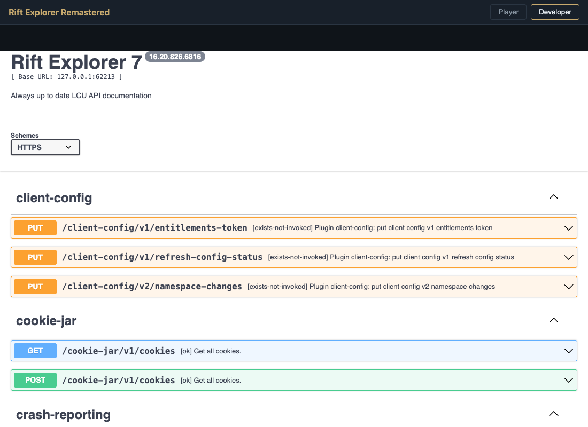

# Rift Explorer Remastered

A desktop companion for the League of Legends client. It reads your own client
through its local API, so it can show your profile, rewards, loot and rune pages,
and it can change the things the client's profile screen already lets you change.

Under development.

This is a rewrite of [Pupix/rift-explorer](https://github.com/Pupix/rift-explorer),
the original Electron app. It is now built with Tauri 2, with a Bun sidecar that
talks to the client.

## Screenshots

Your name, tag, level, icon and status message are blurred in every screenshot.

| Overview | Icon | Border & banner |
| --- | --- | --- |
|  |  |  |
| **Background** | **Title & tokens** | **Rewards** |
|  |  |  |
| **Loot** | **Rune pages** | **Auto champ select** |
|  |  |  |
| **Developer (API docs)** | | |
|  | | |

## What it does

- **Profile:** level, ranked tiers, recent games with a summary, and a live refresh
  while the tab is open, so changes made in the client show up.
- **Icon, border, banner and background:** pick from the icons, skins and crests you own.
- **Title and tokens:** pick an owned title and up to three earned challenge tokens.
- **Rewards:** list the rewards waiting to be claimed, and claim them one at a time or all at once.
- **Loot:** wallet balances, and what your loot is worth if you disenchant it.
- **Rune pages:** view and edit your rune pages, with the client's rules checked
  before anything is saved. Buying a page is shown only when the store offers it.
- **Status message:** set your custom message and online status.
- **Auto champ select (optional, off by default):** accept the match, and ban or
  pick from your lists, in champ select.
- **Developer:** the client's local API as browsable docs, read-only.

## Requirements

- The League of Legends client, running and logged in.
- macOS, Windows or Linux. The app finds the client on macOS and Windows, and on
  Linux you need to point it at the lockfile yourself.

## Build and run

You need [Bun](https://bun.sh) and [Rust](https://rustup.rs), plus the
[Tauri prerequisites](https://tauri.app/start/prerequisites/) for your system.

```sh
bun install
bun run sidecar          # builds the sidecar for your platform
bun run tauri dev        # run the app
bun test                 # sidecar and app tests
```

## Releases

The release workflow builds the app for macOS (Apple Silicon), Windows and Linux
when a `v*` tag is pushed. The installers are attached to the GitHub release.
The builds are unsigned, so your system may ask you to confirm before opening them.

## Notes

- This app uses the League client's local API, which Riot does not document for
  third-party tools. Riot can change or remove it at any time.
- Auto champ select changes what you pick and ban in the client. Use it at your own
  risk, and check Riot's rules before you do.
- Your data stays on your machine. The app only talks to the client on your computer,
  except for loading champion art from public Riot and community image sites.
